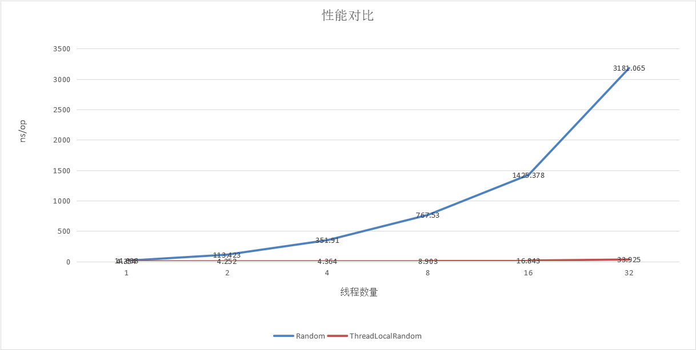

# 随机函数性能验证

## 描述

使用JMH测试Random与ThreadLocalRandom并发性能


## 本地验证

### 本地环境

| 类目     | 配置                                |
| -------- | :---------------------------------- |
| 操作系统 | win10 x64                           |
| CPU      | Intel(R) Core(TM) i5-6300HQ 2.30GHz |
| RAM      | 8G                                  |
| JDK      | 1.8.0_171                           |


### 本地验证结果

#### 1线程

```
Benchmark                                 Mode  Cnt   Score   Error  Units
RandonBenchmark.measureRandom             avgt    3  14.038 ± 0.307  ns/op
RandonBenchmark.threadLocalmeasureRandom  avgt    3   4.354 ± 0.082  ns/op
```


#### 2线程

```
Benchmark                                 Mode  Cnt    Score    Error  Units
RandonBenchmark.measureRandom             avgt    3  113.423 ± 31.950  ns/op
RandonBenchmark.threadLocalmeasureRandom  avgt    3    4.252 ±  0.681  ns/op
```


#### 4线程

```
Benchmark                                 Mode  Cnt    Score    Error  Units
RandonBenchmark.measureRandom             avgt    3  351.910 ± 17.897  ns/op
RandonBenchmark.threadLocalmeasureRandom  avgt    3    4.364 ±  1.037  ns/op
```


#### 8线程

```
Benchmark                                 Mode  Cnt    Score      Error  Units
RandonBenchmark.measureRandom             avgt    3  767.530 ± 1024.928  ns/op
RandonBenchmark.threadLocalmeasureRandom  avgt    3    8.903 ±    3.339  ns/op
```


#### 16线程

```
Benchmark                                 Mode  Cnt     Score     Error  Units
RandonBenchmark.measureRandom             avgt    3  1425.378 ± 722.019  ns/op
RandonBenchmark.threadLocalmeasureRandom  avgt    3    16.843 ±   4.376  ns/op
```


#### 32线程

```
Benchmark                                 Mode  Cnt     Score      Error  Units
RandonBenchmark.measureRandom             avgt    3  3181.065 ± 2894.573  ns/op
RandonBenchmark.threadLocalmeasureRandom  avgt    3    33.925 ±   18.531  ns/op
```


## 结果分析

| 并发线程数 | Random         | ThreadLocalRandom |
| ---------- | -------------- | ----------------- |
| 1          | 14.038 ns/op   | 4.354 ns/op       |
| 2          | 113.423 ns/op  | 4.252 ns/op       |
| 4          | 351.910 ns/op  | 4.364 ns/op       |
| 8          | 767.530 ns/op  | 8.903 ns/op       |
| 16         | 1425.378 ns/op | 16.843 ns/op      |
| 32         | 3181.065 ns/op | 33.925 ns/op      |



可以看到，ThreadLocalRandom耗时比Random少，且Random随着线程数增加性能急剧下降，而ThreadLocalRandom波动不大。